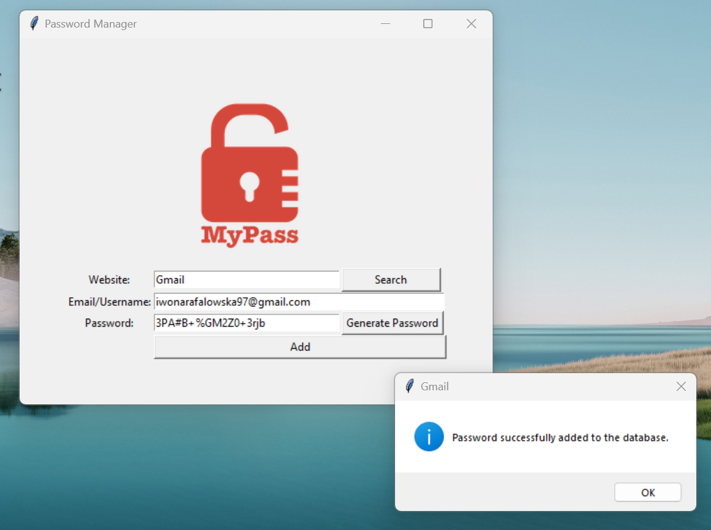
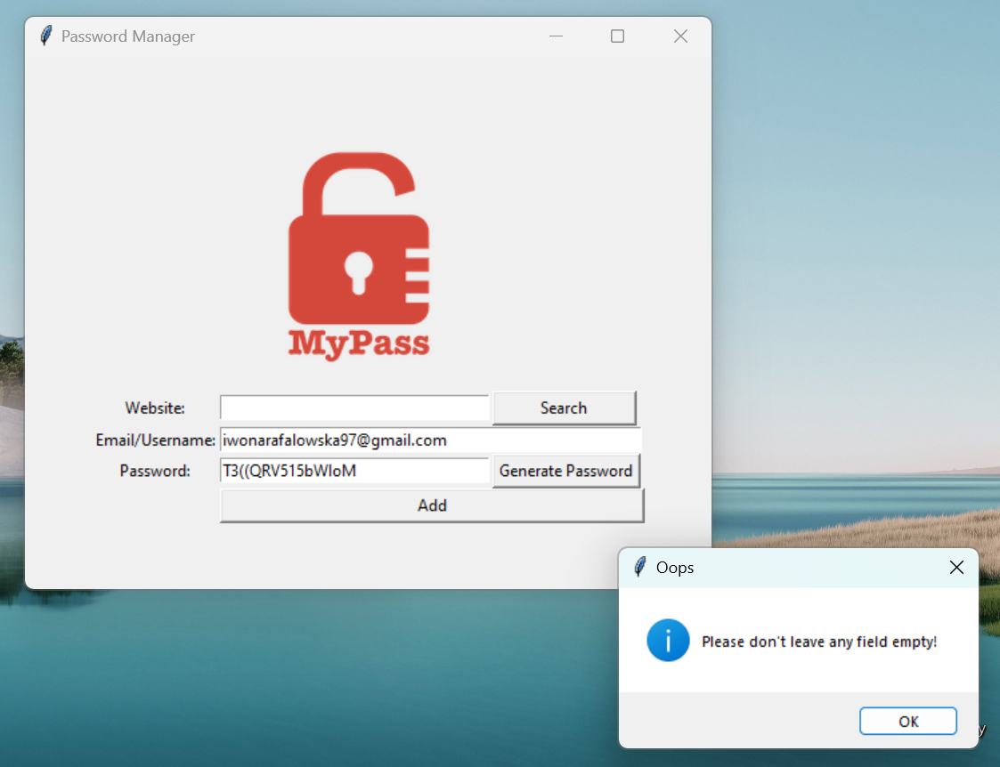
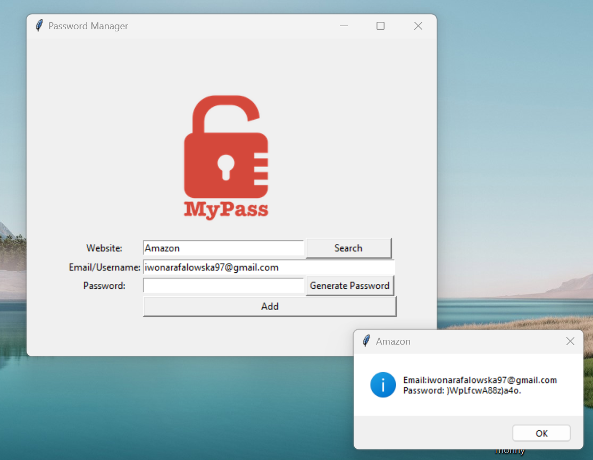

# Password Manager 🔒🗝️*️⃣

This is a simple password manager application built using Python's Tkinter library for the graphical user interface (GUI) and JSON file format to store the data.

## Features

- **Add Passwords**: Easily add passwords for various websites along with your email/username.
- **Search Passwords**: Search for passwords stored in the database by entering the website name.
- **Generate Passwords**: Generate strong, random passwords with just a click of a button.

## Technologies Used

- **Python**: The application is written in Python programming language. 🐍
- **Tkinter**: Tkinter is used to create the graphical user interface (GUI) for the application. 🖥️
- **JSON**: JSON file format is utilized to store the password data in a structured manner. 📋

## Usage

1. **Add Passwords**:
   - Enter the website name, email/username, and password in the respective fields.
   - Click on the "Add" button to save the password to the database.

     
     
     
2. **Search Passwords**:
   - Enter the website name in the search field.
   - Click on the "Search" button to retrieve the password associated with the website.

     

3. **Generate Passwords**:
   - Click on the "Generate Password" button to generate a strong, random password.
   - The generated password will be automatically copied to your clipboard for easy use.

## How it Works

- When you add a password, the application stores the data in a JSON file named `data.json`.
- When you search for a password, the application retrieves the data from the JSON file and displays the corresponding password.
- The application also provides functionality to generate random passwords using a combination of letters, numbers, and symbols.

## Future Enhancements

- Implement encryption to secure the password data.
- Add an option to edit or delete passwords from the database.
- Improve the password generation algorithm for more complex passwords.

## Contributions

Contributions to this project are welcome! If you have any suggestions, improvements, or bug fixes, feel free to submit a pull request.

## License

This project is licensed under the MIT License. See the [LICENSE](LICENSE) file for details.
